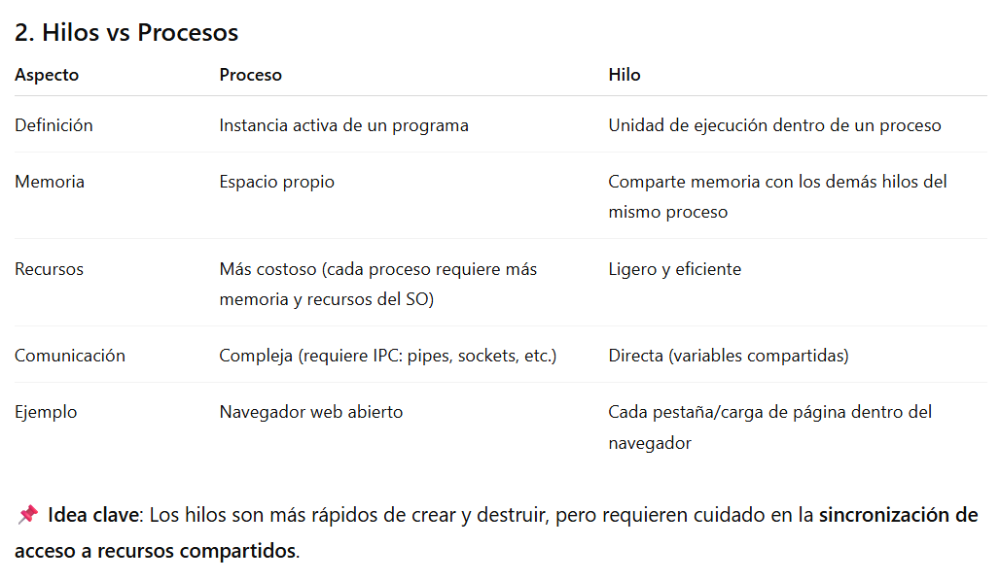
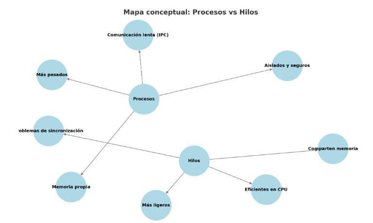

# Programación sobre redes - Carrera Desarrollo de Software

## Clase 1 - Programación concurrente

🔹 Introducción

1. ¿Qué es la programación concurrente?

Definición: Paradigma donde múltiples tareas (procesos o hilos) progresan de forma solapada.

No implica siempre ejecución simultánea física, salvo en sistemas multinúcleo.

Objetivo: eficiencia y respuesta más rápida en aplicaciones que realizan varias tareas (ej.: servidores web, simulaciones, juegos en red).

🔹 Ejemplo intuitivo:
Un restaurante con un solo cocinero (CPU de un núcleo). Este puede ir alternando entre preparar entradas, plato principal y postre sin terminar uno antes de empezar el otro → concurrencia.
Si hay varios cocineros (CPU multinúcleo), realmente trabajan en paralelo → paralelismo.

2. Hilos vs procesos

3. Problemas de concurrencia y sincronización

La concurrencia trae riesgos:

Condiciones de carrera (race conditions): cuando dos hilos acceden y modifican la misma variable al mismo tiempo → resultados impredecibles.

Interbloqueo (deadlock): dos hilos esperan recursos bloqueados mutuamente → ninguno avanza.

Inanición (starvation): un hilo nunca obtiene tiempo de CPU.

🔧 Mecanismos de control en Python:

Lock (bloqueos mutuos).

Semaphore (control de acceso a recursos limitados).

Condition (coordinar hilos: esperar y notificar).

Event (señales entre hilos).

4. Ejercicios prácticos (del PDF)

Ejercicio 1: Contar en paralelo (dos hilos, 1–5 y 6–10).

Ejercicio 2: Sincronización con Condition: esperar a que ambos hilos terminen antes de imprimir el resultado final.

💡 Estos ejercicios preparan para aplicaciones reales como servidores concurrentes que atienden múltiples clientes.

5. Glosario

Concurrencia: Ejecución solapada de tareas.

Paralelismo: Ejecución real al mismo tiempo (varios núcleos).

Proceso: Programa en ejecución con memoria propia.

Hilo (thread): Unidad de ejecución dentro de un proceso.

Race condition: Conflicto por acceso concurrente a recursos.

Deadlock: Bloqueo mutuo entre procesos o hilos.

Sincronización: Técnicas para coordinar la ejecución concurrente.

🔹 Ejercicios

Mejorar el código presentado:

1. "Contando en paralelo"

Parámetros Flexibles: El resuelto tiene el rango que se calculaba con inicio + i y el límite estaba hardcodeado

Configuración Centralizada: Los hilos se creaban manualmente uno por uno.

Manejo Dinámico de Hilos: Join explícito para cada hilo (hilo1.join(), hilo2.join()).

2.  "Sincronización de hilos"

Eliminación de Variables Globales: condicion y resultados son globales.

Uso de wait_for en lugar de while: Bucle while len(resultados) < 2 con wait().

Generación Dinámica de Hilos: Hilos creados manualmente (hilo1, hilo2).

Cálculo Directo con sum(range()): Bucle for para sumar números.

## Clase 2 - Procesos e hilos (Multithreading)

🔹 Hilos (Multithreading)

Permiten ejecutar múltiples tareas dentro de un mismo proceso.

Se ejecutan en paralelo (si hay varios núcleos) o concurrentemente (si hay un solo núcleo).

Uso típico: descargas en segundo plano, procesamiento simultáneo, mantener interfaces gráficas activas.

Ventajas: eficiencia, mejor uso de CPU, interactividad.
Desventajas: problemas de sincronización, mayor complejidad, sobrecarga si se crean demasiados hilos.

🔹 Procesos

Un proceso = un programa en ejecución con su propio espacio de memoria.

Cada proceso es independiente y no accede directamente a la memoria de otro.

Contiene segmentos de memoria: código, datos, pila, heap.

Estados: nuevo, ejecutando, esperando, listo, terminado.

Identificador único: PID.

Comunicación entre procesos (IPC): pipes, memoria compartida, colas de mensajes, sockets.

Ventajas: aislamiento, seguridad.
Desventajas: mayor consumo de recursos, comunicación más lenta que entre hilos.

🔹 Diferencia clave

Proceso: unidad independiente, memoria aislada.

Hilo: subunidad dentro de un proceso, comparte memoria y recursos.

🔹 Glosario de términos clave

Hilo (Thread): unidad mínima de ejecución dentro de un proceso.

Proceso: programa en ejecución con memoria y recursos propios.

PID: identificador único de un proceso.

Heap: memoria dinámica del proceso.

Stack (pila): memoria temporal para funciones y variables locales.

Condición de carrera: error cuando dos hilos acceden al mismo recurso sin control.

IPC (Inter-Process Communication): mecanismos de comunicación entre procesos.

Mapa conceptal: Procesos vs Hilos

